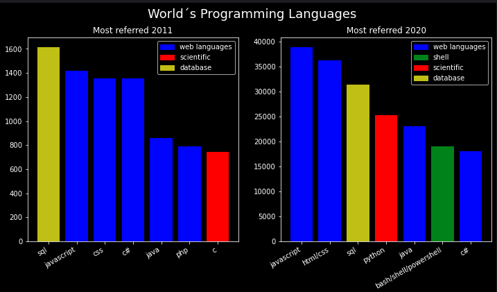
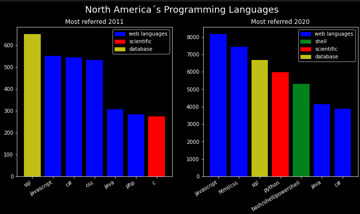
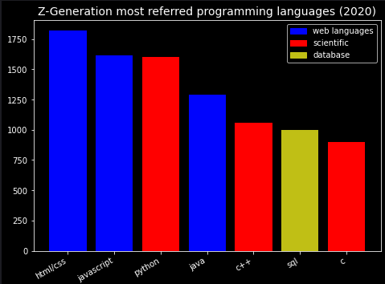
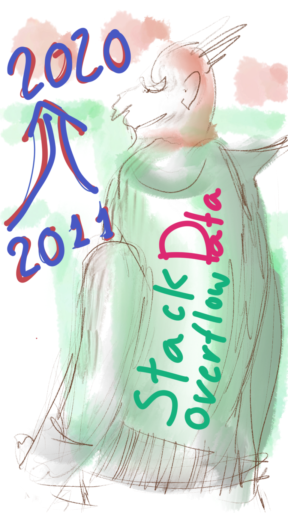

## Stack Overflow Survey [2011](https://stackoverflow.blog/2011/01/11/survey-says/?_ga=2.150969846.175672837.1626630581-112540995.1615731573) Vs [2020](https://insights.stackoverflow.com/survey/2020)

---

So many things changed in the world in this time... and **Stack Overflow** questions & answers for programmers has being growing so much...

### Introduction

This work is based on public data. I got both .csv at Stack Overflow Website (link above). The idea was to compare Programming Languages preferences on two time windows spaced by 9 years.

Stack Overflow is a website about submiting programming languages **code** that is not working and giving some information about what you are pretending. People try to correct your code, giving you some explanations about it. For starters, its a kindo of **paradise**!

And for more experienced persons, it is nice too. You can use your good answers as a **visit card**.

It is **very dynamic** and in **constant growth** environment: 

>- in this nine years, counts about referred languages by surveyers had an increment of more than 20 times; 
>- as it captures in yearly surveys almost **new programmers**, it can point what are the tendencies for a near future, about programming;
>- it is not only about counting **programming languages**, the idea is try to classify them in **general blocks** (as **scientific/development** purpose, **web applications**, etc..);

The most challenging part was to adapt both .csv files for a common format, for data extraction. It was not so easy, as the 2011 ans 2020 surveys follows quite different structures. On my Jupyter Notebook I created a lot of functions for general dataframes adaptation (**Pandas**). All my code was written in Python 3.X. And these functions were collected in a library, named **udacours.py**. All this coding is under MIT licence. So, please use it as you wish!

#### Question 1 - How programming languages preference seemed to evolve 2011 vs 2020?

Explanation:
>- **2011** the most referred language at Stack Overflow was for **database** purposes;
>- **2011** it was followed by several **web languages**, and then as a **scientific language**, most referred was C;
>- **2020** shows a tendency for more enphasys in fewer **web langages**, followed by a **database** language;
>- **2020** shows a clear preference for Python, instead of C. And now it appears in the **forth position**;
>- **2020** gives us a general feeling that **new programmers** are trying Python. One possible explanation is that Python is referred as a **easy to learn** programming language.   

#### Question 2 - How North America differs from the rest of the world?

Explanation:
>- when I was young, North America was known as the **world influencer**; 
>- so if something happened there, it will likely be the **new tendency** for other countries;
>- as it takes some time for influences to spread all over the world, it is expected that filtering for US you could obtain a more **futuristic** shape;
>- it seemed that it was not the case anymore, as new technologies are spreading so fast, the world tendency **curiously** seems to be the same for US and for the summation of all the countries in the world.

#### Question 3 - And about Z-Generation?

Explanation:

>- **Z Generation**, or **Gen Z** are known as **zoomers**, a generation that had contact with new IT technologies even in very young age;
>- a better explanation about **zoomers** can be found at [Wikipedia](https://en.wikipedia.org/wiki/Generation_Z);
>- as human generations are time-dependent, it is impossible to compare 2011-2020 data. The only thing to do is to show the 2020 filtered data and take some possible conclusions;
>- and the general tendency is for two strong **web languages** (as newspapers are giving place to weblogs), followed to **Python** in third, and referring two more **scientific languages**;
>- so if we rely on these data, we can assume a strong preference for **web languages** (frontend), followed by **scientific languages** (for most diverse purposes);
>- **SQL** (database language) seems to remain important for this generation too! 

### Conclusion

We can see a strong tendency for **technological concentration** in fewer solutions. A real-time spreading of new paradigms (so the cultural gap between nore advanced cultures and the rest of the world tends to disappear). And a strong preference at *zoomers* for website solutions, scientific languages, and in some points, for database structures.

How reliable is this data?

>- it is based only on **one website**, speciallized on giving support for **new kids in the block**;
>- so, data is clearly **biased**, but if you consider the purpose of this website, you star formulating **new world tendencies** for programming languages, in a near future
>- other inferences, as the relation of **NaN** data over the entire survey, you can find in the Jupyter Notebook that follows this project;
>- another point to say is that this language classification is a bit **arbitrary**, I made it based only on my work practice as an **Engineer** working for Brazillian Government, it is only for illustration purpose about programming langages tendencies.

How about seeing how answers changed between this two time windows?

Hom many people referred to **Python**, or to **SQL** in this time lapse?

Let´s see some answers for this, and other questions in my project!

[my Jupyter Notebook](https://github.com/epasseto/UdacityFirstProject)

---

Link for maintaining the content of this blog [here](https://github.com/epasseto/First-Udacity-Datascience-Blog/edit/gh-pages/index.md)

After commitig, Website rebuilt page [here](https://jekyllrb.com/)

---

Markdown and other GitHub environmental details for this blog

This Webpage is formatted using **Markdown**

For more details see [GitHub Flavored Markdown](https://guides.github.com/features/mastering-markdown/)

GitHub support can be found [here](https://support.github.com/contact)

GitHub documentation is [here](https://docs.github.com/categories/github-pages-basics/)

This Webpage is based on Jekyll theme **Midnight**, that you can find [here](https://github.com/epasseto/First-Udacity-Datascience-Blog/settings/pages)
